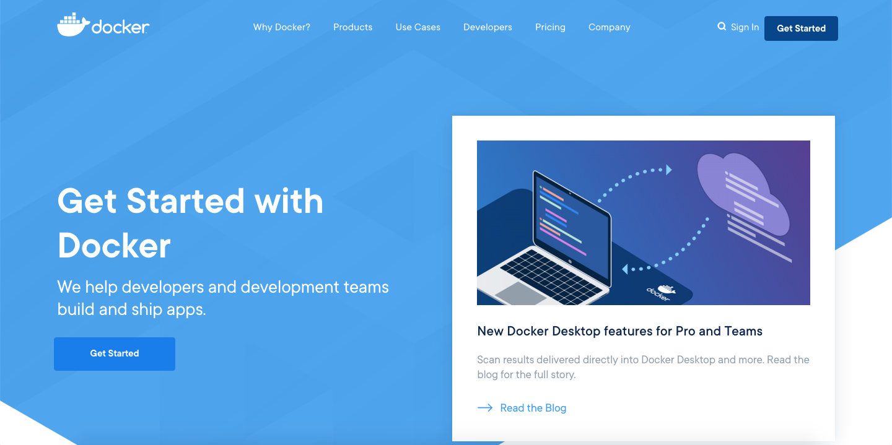

 
>IES Celia Viñas (Almería) - Curso 2020/2021    
>Módulo: ASGBD - Administración de Sistemas Gestores de Bases de Datos    
>Ciclo: CFGS Administración de Sistemas Informáticos en Red   

### Instalación de Docker
> Configuración previa   
> :warning: Para esta práctica en nuestro caso, usamos una imagen de **macOS Catalina** Versión 10.15.7.   

Docker se caracteriza porque automatiza el despliegue de[ aplicaciones](https://es.wikipedia.org/wiki/Aplicaci%C3%B3n_inform%C3%A1tica) dentro de[ contenedores de software](https://es.wikipedia.org/wiki/Contenedores_de_software). 

1. Descarga e instala Docker Desktop.

- Primero nos dirigimos a la web de Docker  [https://www.docker.com/](https://www.docker.com/) . 



- Una vez allí pulsamos en **Get Started**.

Elegimos la versión que queremos instalar y seguimos los pasos.

- Instalación para Mac.


#### Instalamos Docker

- Arrastramos el Docker hasta la carpeta de aplicaciones.


- Cuando termine la instalación se agregará a el icono a la barra de herramientas.


- Desplegamos el menú con las diferentes opciones.

![Docker]{{ site.baseurl }}(images/mac5.png "image_Docker")

2. Muestra por línea de comando y luego desde Docker Desktop las imágenes que  tienes descargada en Docker.


3. Descarga la última imagen de MySQL desde el hub de Docker por línea de comandos. Indica en el documento que estás creando de qué versión se trata.

```bash
 $ sudo docker search mysql
 $ sudo docker pull mysql
```


4. Muestra de nuevo por línea de comando y luego desde Docker Desktop las imágenes que tienes descargada en Docker.


5. La imagen por sí sola no hace nada, tendremos que crear un contenedor con dicha imagen. Por lo tanto, crea un contenedor mediante línea de comandos que ejecute el servidor de MySQL teniendo en cuenta que: 

*   Usaremos la imagen que acabamos de descargar. 
*   El servicio que arrancaremos al levantar este contenedor de MySQL deberá  tener el nombre ‘mysql&lt;versión>’. Esto nos ayudará luego para identificarlo  más rápido por si quisiéramos, por ejemplo, detener el servicio. 
*   Lo crearemos con la contraseña del usuario root ‘root’. 
*   Docker por defecto guarda la información en el interior del contenedor, por lo  que cuando eliminemos el contenedor, se eliminará dicha información.  Deberemos agregar en el comando la persistencia de datos hacia una carpeta  existente en nuestro PC local. 
*   Usaremos el puerto 3306 tanto del pc local como el del contenedor Docker.
*   Necesitaremos que el contenedor se esté ejecutando constantemente en  background (o fondo). 

```bash
 $ sudo docker run -d --rm --name mysql -e MYSQL_ROOT_PASSWORD=root -p 3306:3306 -v mysql_data:/var/lib/mysql mysql:8.0.22
```


6. Comprueba, mediante línea de comandos y desde Docker Desktop, que contenedores están corriendo (status up). 


7. Si el servicio está corriendo, entra en MySQL y visualiza las bases de datos  existentes. 

- Instalamos el cliente mysql, el servidor y accedemos: 

```
$ brew install mysql-client
$ mysql -u root -p
```

#### Instalación de MySQL Workbench

8. Instala el cliente MySQL Workbench en el PC local y accede al servicio que hemos arrancado (IP 127.0.0.1 -> localhost). 

- Descargamos Workbench


- Instalamos


-  Iniciamos sesión el localhost como el usuario y contraseña definidos al lanzar el contenedor.

![Docker]{{ site.baseurl }}images/mac18.png "image_Docker")

9. Visualiza las bases de datos existentes en el servidor desde el cliente MySQL Workbench. 


10. Crea dos nuevas bases de datos desde la línea de comandos. 


11. Vuelve a visualizar las bases de datos existentes de las dos formas (línea de  comandos y cliente), para comprobar que se actualiza correctamente. 


12. Elimina una base de datos desde MySQL Workbench (mantén la otra). 


13. Vuelve a visualizar las bases de datos existentes de las dos formas (línea de  comandos y cliente), para comprobar que se actualiza correctamente. 


14. Sal de MySQL (exit;) 

15. Comprueba, mediante línea de comandos y desde Docker Desktop que 

contenedores están corriendo (status up). 


16. Para el contenedor de MySQL. 


17. Muestra todos los contenedores que tenemos, incluso los parados. 


- Ejecutamos el comando ```docker ps -a``` donde ```-a``` es la abreviatura de ```-all```. 

18. Intenta acceder a una tabla en MySQL Workbench ¿Qué ocurre? ¿Por qué? 


- No podemos acceder ya que al no tener ningún contenedor ejecutandose en local no puede acceder a el.

19. Comprueba el estado de la carpeta local donde tenemos referenciado docker. 


20. Elimina el contenedor y comprueba que los datos de la carpeta local del PC no se  han eliminado. 

- Al hacer ```docker stop```comprobamos que ha terminado el contenedor.

21. Volver a crear el contenedor vinculandolo a la misma carpeta local y comprobar que mediante línea de comandos que vuelve a estar toda la información, incluida la base  de datos que hemos creado. 


- Lanzamos de nuevo el contenedor.


- Comprobamos que los datos siguen guardados.

22. Comprobar la conexión desde MySQL Workbench. 


- Conexión con MySQLWorkbench

### AMPLIACIÓN 

Instalar phpMyAdmin haciendo uso de Docker, teniendo en cuenta que hay que ‘lincarlo’ al servicio MySQL que ya hemos creado, sino irán como en servicios independientes y  no se podrá acceder desde phpMyAdmin a MySQL server. Una vez instalado, probar a abrir phpMyAdmin desde un navegador en local e  interactuar sobre las bases de datos.

```docker run -d --rm --name phpmyadminc --link mysqlc -e PMA_HOST=mysqlc -p 8080:80 phpmyadmin/phpmyadmin```


- Lanzamos un contenedor docker para phpmyadmin.

## Referencias

*   [José Juan Sanchez](https://josejuansanchez.org/bd)
*   [https://www.docker.com/](https://www.docker.com/)
*   [http://www.mysql.com](http://www.mysql.com)
*   [https://hub.docker.com](https://hub.docker.com)
*   [Buscar y descargar contenedor Docker](https://www.linuxparty.es/115-docker/10270-como-buscar-imagenes-docker-y-lanzar-un-contenedor.html)
