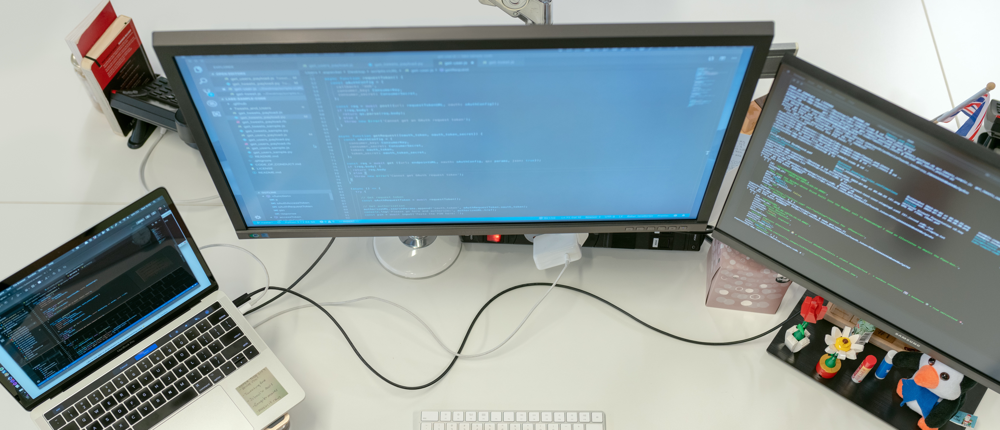

> 2021 

## Herramientas para Windows
**Links**: 
- [Malwarebytes](https://www.malwarebytes.com/mwb-download/thankyou/)
- [Superantispyware](https://www.superantispyware.com/downloadfile.html?productid=SUPERANTISPYWAREFRE*E)
- [Eset Scan](http://download.eset.com/special/eos/ESETOnlineScanner_ESL.exe)
- [Windows Slimmer](https://www.auslogics.com/es/software/windows-slimmer/)

Desinstalador:
- [Geek Uninstaller](https://www.geekuninstaller.com/geek.zip)

HHD / SSD:
- [CrystalDisk info](https://crystalmark.info/en/software/crystaldiskinfo/)

Hardware:
- [HWmonitor](https://download.cpuid.com/hwmonitor/hwmonitor_1.43.zip)

Reparación **Windows Update**:
- [Tweaking](https://www.tweaking.com/files/setups/tweaking.com_windows_repair_aio_setup.exe)

### Liberador de espacio en disco
``
cleanmgr
``
### Restablecer TCP/IP
``
netsh winsock reset
netsh int ip reset
``
### Limpiar cache DNS
``
ipconfig /flushdns
``
## Herramientas para Mac
**Links**:
-
## Puesta a punto Windows/MAC
Instalación y actualización de programas:
- [Ninite](https://ninite.com/)
