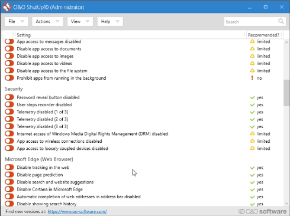
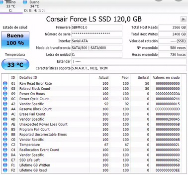
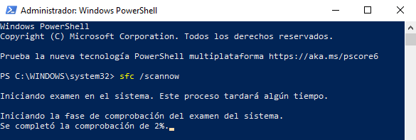
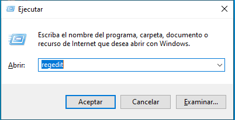
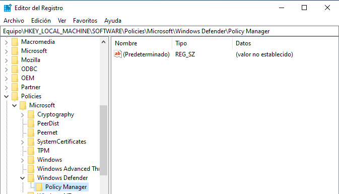
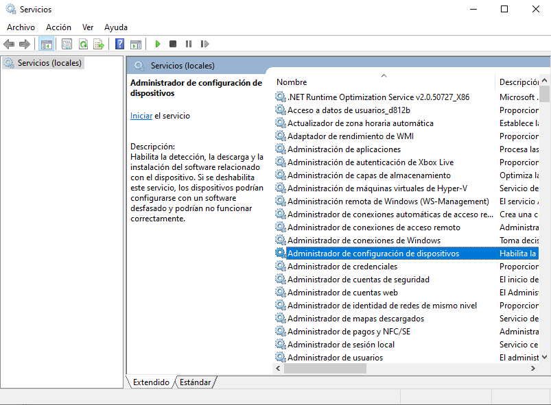
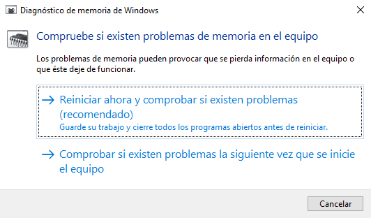
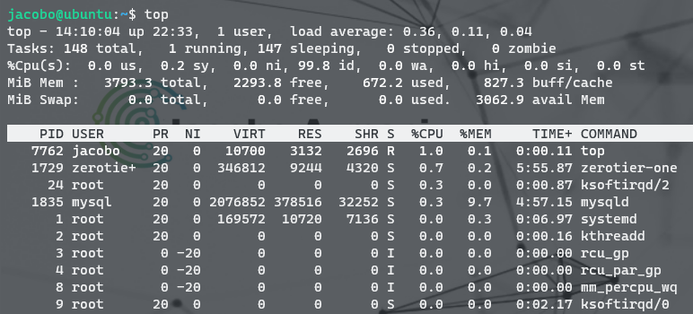

# COMANDOS Y HERRAMIENTAS
> 2021 

## Índice
- [Herramientas para Windows](#1)
- [Liberador de espacio en disco](#2)
- [Restablecer TCP/IP](#3)
- [Limpiar cache DNS](#4)
- [Limpiar ```WinsockFix```](#5)
- [Updates Windows](#6)
- [Habilitar Windows Defender](#7)
- [Matar un proceso usando ```Taskkill```](#8)
- [Iniciar/detener servicios en Windows](#9)
- [Solucionar el error de ```memory management``` Windows 10](#10)
- [Eliminar cola de impresión](#11)
- [MacOS](#12)

--- 

# <a name="1">Herramientas para Windows</a>
**Links**: 
- [Malwarebytes](https://www.malwarebytes.com/mwb-download/thankyou/)
- [Superantispyware](https://www.superantispyware.com/downloadfile.html?productid=SUPERANTISPYWAREFRE*E)
- [Eset Scan](http://download.eset.com/special/eos/ESETOnlineScanner_ESL.exe)
- [Windows Slimmer](https://www.auslogics.com/es/software/windows-slimmer/)
- [O&O ShutUp10](https://www.oo-software.com/en/shutup10) 
> Es totalmente gratuito y no tiene que ser instalado - simplemente se puede ejecutar directamente y de inmediato en su PC. Gracias a **O&O ShutUp10**, usted tiene el control total sobre las funciones de confort de Windows 10 que desea utilizar y decide cuándo la transmisión de sus datos va demasiado lejos. A través de una interfaz muy sencilla, usted decide cómo Windows 10 debe respetar su privacidad, decidiendo qué funciones no deseadas deben ser desactivadas. 



Desinstalador:
- [Geek Uninstaller](https://www.geekuninstaller.com/geek.zip)
> Es una aplicación portable (no necesita instalación) y gratuita que lleva a cabo una eliminación completa de cualquier programa instalado en Windows, incluidos todos los archivos ligados a la misma y las referencias en el Registro de Windows. 

- [IObit Unlocker](https://iobit-unlocker.uptodown.com/windows)
> IObit Unlocker es una aplicación que nos permitirá eliminar aquellos archivos que por cualquier motivo se encuentran bloqueados en nuestro ordenador y que al intentar borrarlos recibimos un mensaje de error que nos comunica que es imposible. 

HHD / SSD:
- [CrystalDisk info](https://crystalmark.info/en/software/crystaldiskinfo/)



Hardware:
- [HWmonitor](https://download.cpuid.com/hwmonitor/hwmonitor_1.43.zip)
> Un programa de monitoreo de hardware que lee los sistemas de PC principales sensores de salud:. voltajes, temperaturas, ventiladores de velocidad. 

---  

### <a name="2">Liberador de espacio en disco</a>
Borra archivos innecesarios del disco duro del equipo. Puede usar las opciones de línea de comandos para especificar que cleanmgr Limpie los archivos temporales, los archivos de Internet, los archivos descargados y los archivos de la papelera de reciclaje.
```c
cleanmgr
```
---

### <a name="3">Restablecer TCP/IP</a>
Ejecutamos en la ```consola```:
```c
netsh winsock reset
```
```c
netsh int ip reset
```
---

#### <a name="4">Limpiar cache DNS</a>
Ejecutamos en la ```consola```:
```c
ipconfig /flushdns
```
---

#### <a name="5">Limpiar ```WinsockFix```</a>
Para hacerlo de **forma manual** vamos a hacer lo siguiente:

- En Windows XP:
Hacemos click en ```INICIO/EJECUTAR``` y escribimos ```cmd```.

En la consola escribimos 
```
netsh winsock reset catalog
``` 
y presionamos **ENTER**, luego escribimos 
```
netsh int ip reset resetlog.txt
``` 
y **ENTER** nuevamente, reiniciamos nuestro sistema y debería estar funcionando.

- Para Windows 7:
Hacemos click en ```INICIO``` y en el cuadro de búsqueda escribimos ```cmd```.
Hacemos click derecho sobre ```cmd.exe``` y seleccionamos **Ejecutar como Administrador**

Escribimos: 
```
netsh winsock reset catalog
``` 
y presionamos **ENTER**. Luego escribimos: 
```
netsh int ip reset resetlog.txt
``` 
y **ENTER** nuevamente, reiniciamos nuestro sistema.

--- 

### <a name="6">Updates Windows</a>
**DISM** crea un archivo de registro (```%windir%/Logs/CBS/CBS.log```) que captura cualquier problema que la herramienta encontró o corrigió. ```%windir%``` es la carpeta en la que está instalado Windows. Por ejemplo, la carpeta ```%windir%``` es ```C:\Windows```.
```c
DISM.exe /Online /Cleanup-image /Restorehealth
```
```c
DISM.exe /Online /Cleanup-Image /RestoreHealth /Source:C:\RepairSource\Windows /LimitAccess
```
---
El comando ```sfc /scannow``` examinará todos los archivos de sistema protegidos y remplaza los archivos dañados con una copia en caché ubicada en una carpeta comprimida en ```%WinDir%\System32\dllcache```.
El marcador de posición ```%WinDir%``` representa la carpeta del sistema operativo Windows. Por ejemplo, ```C:\Windows```. (Fuente: [Microsoft](https://support.microsoft.com/es-es/topic/use-la-herramienta-comprobador-de-archivos-de-sistema-para-reparar-los-archivos-de-sistema-que-faltan-o-est%C3%A1n-da%C3%B1ados-79aa86cb-ca52-166a-92a3-966e85d4094e))
```c
sfc /scannow
```


O bien podemos usar la herramienta [Tweaking](https://www.tweaking.com/files/setups/tweaking.com_windows_repair_aio_setup.exe).

--- 

### <a name="7">Habilitar Windows Defender</a>
En ```regedit```:


```
HKEY_LOCAL_MACHINE\Software\Policies\Microsoft\Windows 
```


Borrar el valor DisableAntiSpyware. 

- Aplica a WinXp, Win Vista, Win7, Win8.x y Win10.

---

### <a name="8">Matar un proceso usando ```Taskkill```</a>
Matar un proceso usando Taskkill
> Nota: Algunos procesos se ejecutan como Administrador (elevado). Para matarlos, debe abrir una instancia de símbolo del sistema elevada. 

Abra el símbolo del sistema como el usuario actual o como Administrador.
Escriba tasklist para ver la lista de procesos en ejecución y sus PID. Como la lista puede ser muy larga, puede utilizar un carácter de tubería con el comando more.
```
tasklist | more
```
Lista de tareas de Windows 10
Para matar un proceso por su PID, escriba el comando
```
taskkill /F /PID pid_number
```
Para matar un proceso por su nombre, escriba el comando
```
taskkill /IM "nombre del proceso" /F
```
Por ejemplo, para matar un proceso por su PID
```
taskkill /F /PID 1242
```
Windows 10 ```Taskkill``` por ```Pid```
Para matar un proceso por su nombre:
```
taskkill /IM "notepad.exe" /F
```
> Nota: Para matar un proceso que se ejecuta de forma elevada, es necesario abrir PowerShell como Administrador. 

Abrir **PowerShell**. Si es necesario, ejecútelo como **Administrador**.
Escriba el comando ```Get-Process``` para ver la lista de procesos en ejecución.
Para matar un proceso por su nombre, ejecute el siguiente ```cmdlet```:
```
Stop-Process -Name "ProcessName" -Force
```
Para matar un proceso por su PID, ejecute el comando
```
Stop-Process -ID PID -Force
```

Ejemplos:
Este comando cerrará el proceso notepad.exe.
```
Stop-Process -Nombre "Notepad" -Force
```

Windows 10 Powershell Matar un Proceso 
El siguiente comando cerrará un proceso con PID 2137.
```
Stop-Process -ID 2137 -Force
```
(Fuente: [Winaero](https://winaero.com/kill-process-windows-10/))

---

### <a name="9">Iniciar/detener servicios en Windows</a>
Acedemos a 
```
ejecutar
```
y escribimos 
```
services.msc
```

Aquí podemos buscar cualquier servicio de Windows que queramos iniciar o detener.

 

### <a name="10">Solucionar el error de ```memory management``` Windows 10</a>
Debemos de reconocer que Windows 10 no se caracteriza demasiado por los pantallazos azules. Por ejemplo, en Windows XP sí que era más común obtener estos bonitos fondos azules. Sin embargo, debemos de prestar especial atención en cómo se producen estos. Sobre todo, si ocurren de forma frecuente podrían deberse a un mal funcionamiento continuado del sistema o de algún componente físicos de nuestro sistema.

- Primer procedimiento: testeo del estado de la memoria RAM
En ``ejecutar`` escribimos ``MDSCHED``.


- Si esto no funciona ejecutamos un ``sfc /scannow``.
(Fuente: [profesionalreview](https://www.profesionalreview.com/2018/11/27/memory-management-windows-10/))


### <a name="11">Eliminar cola de impresión Windows</a>
En ``cmd`` escribimos los siguientes comandos:

Este comando para los servicios de cola de impresión
```c
net stop spooler
```

En ``C:\WINDOWS\system32\spool\PRINTERS`` eliminamos los archivos temporales. 

Con el siguiente reanudamos de nuevo el servicio de impresión.
```c
net start spooler
``` 
--- 

# <a name="12">Herramientas para Mac</a>
**Links** de interés:
- [Optimizar Mac](https://store.bananacomputer.com/blog/mac/7-formas-de-optimizar-tu-mac/84.html)

### Matar un proceso usando ```top```
Para matar un proceso en sistema **MacOS**, en el buscador, escribimos ```terminal```.
Cuando se nos abra, escribimos ```top```, que es el "**administrador de tareas**" de **MacOS** o sistemas **UNIX** y buscamos el proceso, en este caso, por ejemplo, **logmien**. 
Este proceso al igual que en Windows tiene una **ID**, normalmente un número.
Una vez localizado pulsamos ``q`` para salir del proceso ``top`` y acto seguido terminamos el proceso: 
```bash
$ kill "+ID"
```
Ejemplo de ``top``:



Ejemplo de ``kill``:


### Puesta a punto Windows/MAC
Instalación y actualización de programas:
- [Ninite](https://ninite.com/)

## REFERENCIAS
- [Microsoft docs](https://docs.microsoft.com/es-es/)
- [Cleanmgr](https://docs.microsoft.com/es-es/windows-server/administration/windows-commands/cleanmgr)

[Subir](./)

>  <a href="https://jacoboazmani.org" target="_blank">&copy;Jacobo IT</a> 

